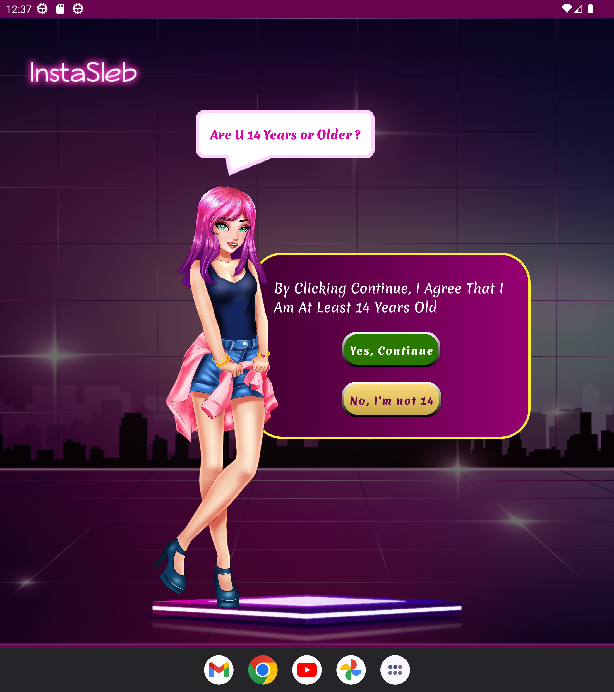
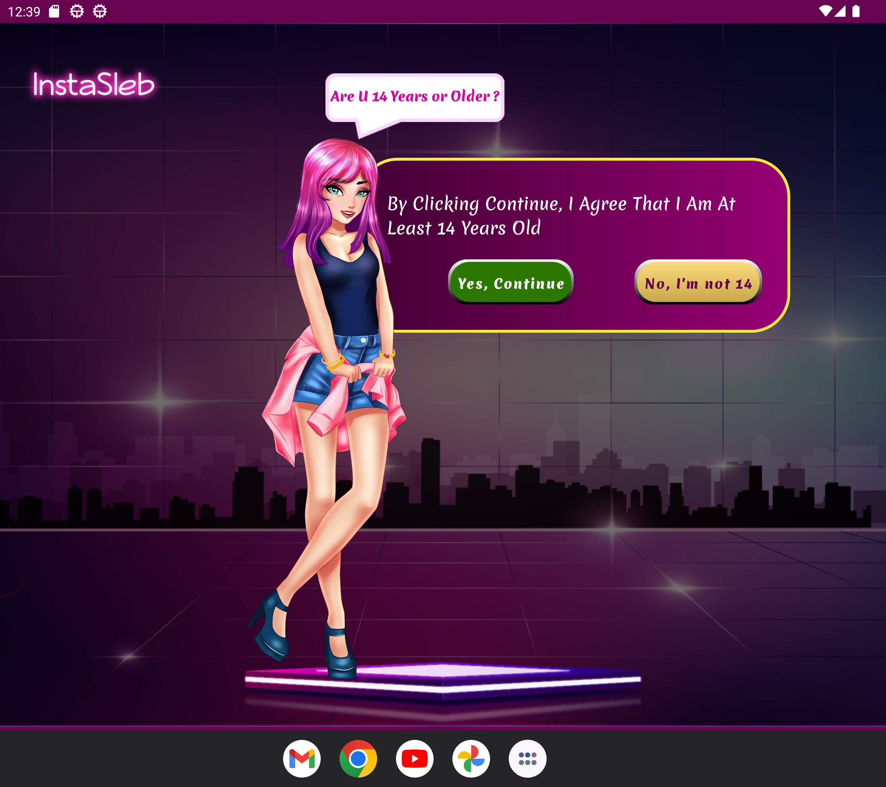

# InstaSleb

Instaselb is an Android application designed for different screen size and different global settings. This README file provides an overview of the app's structure, best practices, and design considerations.

## Screenshots

     

## Best Practices

### Navigation

The app uses the Navigation Component for managing navigation between fragments, ensuring a consistent and predictable user experience, Although this app has only one fragment but i prefered to follow best practices.

### Obfuscation

ProGuard is enabled to obfuscate and shrink the code, enhancing security and reducing the APK size.

### ViewBinding

ViewBinding is used to access views in activities and fragments, improving code readability and reducing the risk of null pointer exceptions.

### Design for Different Screen Sizes

The app supports multiple screen sizes by using ConstraintLayout with guidelines and appropriate layout files for different qualifiers (`layout`, `layout-land`, `values`,`values-land`, `vlaues-sw600`,`vlaues-land-sw600`,`values-sw720`,`vlaues-land-sw600`, etc.).

### Global Settings

The app adapts to different global settings such as font size by using scalable dimensions (`sp` units) for text sizes and following Material Design guidelines for typography.

## Project Structure

- `app/src/main/java`: Contains multiple modules
    - `activity`: Contains two activity and one App file which extends Application (best practices)  
    - `fragments`: Contains one fragment 
- `app/src/main/res`: Contains resources including layouts, drawables, and values.
    - `layout`: Contains XML layout files for standard screen sizes.
    - `layout-land`: Contains XML layout files for both orientation.
    - `values`: Contains XML files for defining dimensions, styles, and other resources.
    - `values-land`, `values-sw600` ..etc: Contains different resources for specific screen size.
- `app/proguard-rules.pro`: ProGuard configuration file for code obfuscation.

## Getting Started

To build and run the app, follow these steps:

1. Clone the repository.
2. Open the project in Android Studio.
3. Build and run the app on an emulator or physical device.

## Dependencies

- AndroidX libraries
- Material Components for Android
- Navigation Component
- SplashScreen core
- ProGuard (enabled in `build.gradle`)
- ViewBinding (enabled in `build.gradle`)
